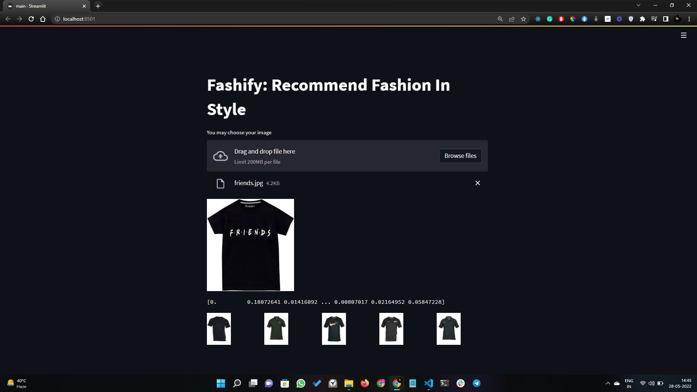
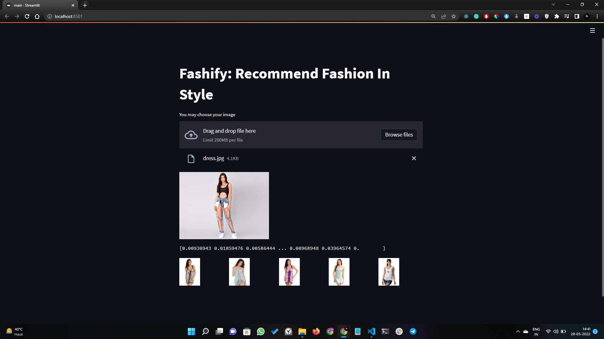
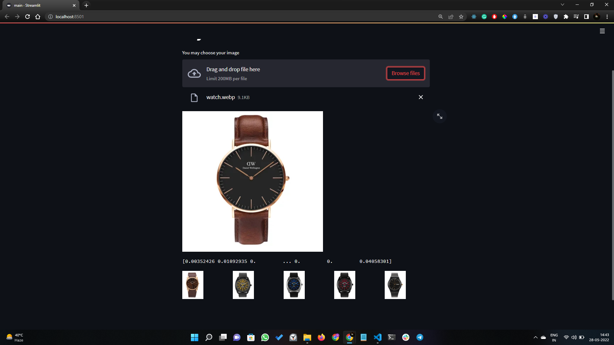

# Fashify : Recommend Fashion in Style
### A real-time Fashion Recommendation end to end web application
***

## What Does Fashify Do?
Fashify is an end-to-end web application based on Machine Learning Algorithms. Fashify is a solution to fashion recommendation, where a user can upload fashion-related images of his/her interest. Once a user uploads an image, Fashify will respond by recommending products that are visually similar enough to the image uploaded by the user.  

This can be well understood as a Reverse Image Search technique that is used at a large scale by giants like Google, Pinterest, etc. For this project, the dataset for the fashion products section belonging to men and women is taken from Kaggle. The image database contains almost 45k (.jpg) files ranging in different categories including T-shirts, jeans, shoes, backpacks, watches, and various other clothing accessories.

**Note: There is a sample folder attached which consists of sample images, which can be used for testing our developed web application.**
***

## Demo of the Project: 

***

## Tech Stacks and Concepts Used: 
***

## Setting Up the Project: 🔧

***

## Working of the Project:

* **Step 1. Importing the model.**

I have loaded a Convolutional Neural Network (CNN) model named ResNet, which is a trained model on the imageNET dataset. The reason for selecting this trained model is its high performance and astounding accuracy. Apparently, I could have made a model of my own. However, training our own model would have given risen to numerous problems. 

Firstly, training our own model would have taken plenty of time thus due to time restrictions working on the top of a trained model seemed suitable.
Secondly, accuracy will never reach such efficiency. Hence, going with this choice is appreciated.
This CNN ResNet model can be imported using the Keras module of Tensorflow. Since this model is already trained on the ImageNet dataset, thus it won’t be used for that purpose. In our project, we have used the ResNet model to extract features of our own dataset.

* **Step 2. Extracting & Exporting Features.**

The approach to solving our fashion recommendation problem is by comparing the features from the available dataset to the features of the image uploaded by the user. As we know, we have a dataset of almost 45k images, thus we will extract the features of all the images present in that dataset and save it. Now, we will extract the features of the image uploaded by the user on the client-side. Once, we get the extracted features for both, we can obtain the 5 nearest vectors which are close enough to the features of the uploaded image.

In order to analyze 45k images, we will be using the ResNet model. CNN model extracts the features layer by layer. For instance, the first layer extracts very basic and primitive features, the second layer extracts somewhat more in detail, and so on.

When our dataset images are given to the ResNet model, it will provide a set of 2048 numbers for every image and these numbers are basically the features. Hence, in the end, we will have a 2D array of (45k, 2048) features. Every single row in this array is a vector with 2048 dimensions. 

When a user uploads an image of his/her own choice, this image will now be given to our ResNet model to extract the features. This will again provide a vector with 2048 features

* **Step 3. Generating Recommendations.**

Finally, we will plot all the vectors on a 2048 dimensional space and compare the vector distances. The first 5 vectors which are closest enough to the user’s image vector, are the results we actually need. The nearest neighbor class will be incorporated from the scikit-learn library. We will use the Nearest Neighbor Algorithm for this project. The approach for this algorithm will be the brute force method through which we will calculate the Euclidean Distance among the vectors and eliminate the results which are larger than the first 5 euclidean Distances.

Fashify will recommend products by approaching the closest vectors that have similar features to that of the uploaded image features.

Hence, we will be able to recommend the most visually similar products to users. This is the working of Fashify.
***

## My Learnings from the Project:

For the development of this project, I used the knowledge of Deep Learning along with Machine Learning. Apparently, within Deep Learning, I have gone through the CNN (Convolutional Neural Network). I have also learned about the Transfer Learning technique, where we can use an already trained model for predictions. The trained model I have used for Fashify is ResNet, which is trained on a dataset imageNET. 
***

## Future Scope:

In the future, I will be working to optimize the approach I have used in order to scale my project.
For now, I have used a dataset of almost 45k images, however, if any dataset would contain images in millions then Fashify will take a relatively long duration to obtain and show results, and ultimately user experience will be downgraded. Thus, to optimize this solution instead of using the scikit-learn library we will be using Annoy library from Spotify. 

I will be deploying this website on AWS, as the dataset is around 20GB which needs to be kept on the server. Hence, I will use an S3 bucket to store such a large dataset and then host it on Amazon Web Services. This will change our code as now images will be displayed from the S3 bucket rather than one of the directories.
***
